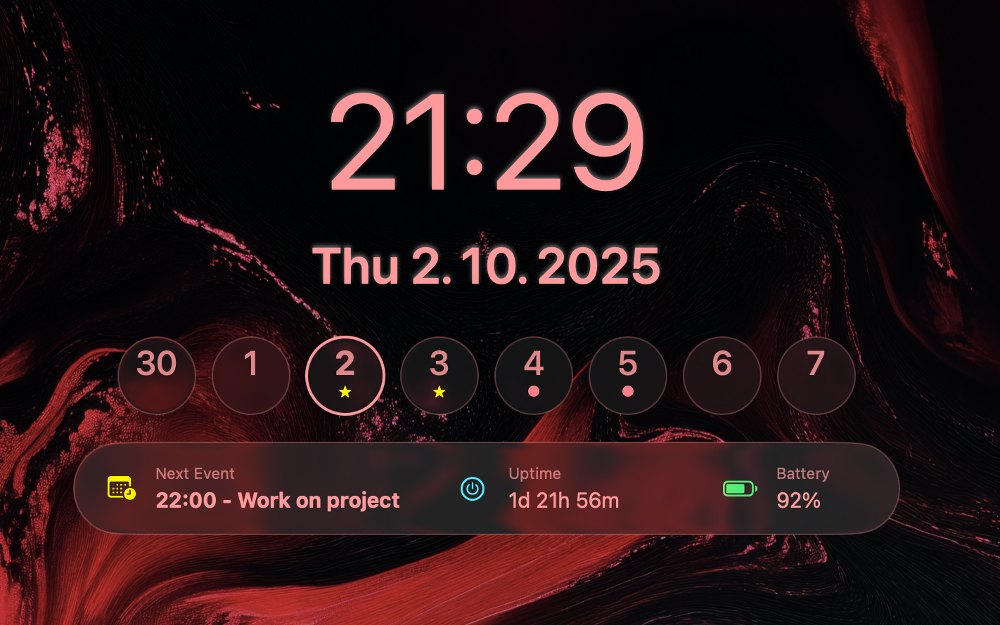

# Desktop Clock for macOS ✨

[](https://www.apple.com/macos)
[](https://swift.org)
[](LICENSE)

A sleek, modern desktop clock and calendar for macOS. It displays the time, date, and an 8-day calendar strip directly on your wallpaper, appearing as a native part of the system.



---
## Features

* **Minimalist Design**: Clean and unobtrusive interface that blends with your desktop.
* **Time & Date**: Large, clear display of the current time and formatted date.
* **8-Day Calendar Strip**: A row of 8 days (2 past, today, 5 future) for a quick overview.
* **Frosted Glass Effect**: The day circles use a beautiful system-native "frosted glass" effect.
* **Event Indicators**: See indicators for weekends, holidays, and your own scheduled events fetched directly from the system's Calendar app.
* **Launch at Startup**: Automatically starts when you log in to your Mac.
* **No Dock Icon**: Runs as a background agent for a seamless experience.
* **Interactive Calendar**: Click on any day circle to open the macOS Calendar app directly to that date.

---
## Installation

You have two options to install the app.

### Option 1: Build from Source (Recommended for Developers) 🔧

If you have Xcode installed, you can build the app yourself.

1.  **Clone the repository:**
    ```sh
    git clone https://github.com/0xMartin/Desktop-Digital-Clock.git
    cd Desktop-Digital-Clock
    ```
2.  **Open the project** in Xcode by double-clicking the `.xcodeproj` file.
3.  **Select your Mac** as the run destination.
4.  Press **`Cmd + R`** to build and run the app. The app will launch, configure itself to start at login, and you're all set!

### Option 2: Using the Pre-built `.app` File (for any user) 🚀

If you're downloading a pre-built `.app` file (e.g., from the "Releases" page), macOS Gatekeeper will block it because it's from an "unidentified developer." You need to manually sign it to allow it to run.

1.  **Download and Unzip**: Download the `DigitalClock.zip` file and unzip it. You will see the `DigitalClock.app` file. Move it to your Desktop for now.

2.  **Open the Terminal**: You can find it in `Applications/Utilities/Terminal.app`.

3.  **Run Two Commands**: You need to run two commands. The easiest way to get the correct path is to **drag and drop the `DigitalClock.app` file from your Desktop directly into the Terminal window** after typing the first part of the command.

    * **First, remove the quarantine attribute:** This tells macOS that you trust the app.
        ```sh
        xattr -cr 
        ```
        (Drag & drop `DigitalClock.app` here)

        Your final command will look like this: `xattr -cr /Users/yourname/Desktop/DigitalClock.app`
        Press **Enter**.

    * **Second, ad-hoc sign the application:** This provides a basic local signature that satisfies macOS security.
        ```sh
        codesign --force --deep --sign - 
        ```
        (Again, drag & drop `DigitalClock.app` here)
        
        Your final command will look like this: `codesign --force --deep --sign - /Users/yourname/Desktop/DigitalClock.app`
        Press **Enter**.

4.  **Move to Applications**: You can now move the `DigitalClock.app` from your Desktop to your `/Applications` folder.

5.  **Run the App**: Double-click the app to run it for the first time. It will ask for Calendar permissions and register itself to launch at login. After a restart, it will launch automatically. ✅

---
## License

This project is licensed under the MIT License - see the `LICENSE` file for details.
